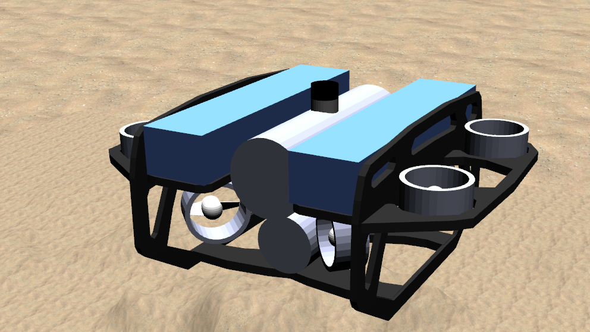

# BlueROV2 Heavy Simulation and Control Framework (ROS 2 Humble)



This repository provides a complete simulation environment that contains the simulation model, hydrodynamic model, actuators, sensors and a cascaded PID control architecture used to simulate and control the BlueROV2 Heavy in Gazebo.

## Table of Contents
1. [Prerequisites & System Requirements](#prerequisites--system-requirements)
2. [Installation & Setup](#installation--setup)
3. [Running the Simulation](#running-the-simulation)
4. [Repository Structure & Architecture Guide](#repository-structure--architecture-guide)
   - [Vehicle Model Description](#1-vehicle-model-description)
   - [Hydrodynamics Parameters](#2-hydrodynamics-parameters)
   - [Sensors Configuration](#3-sensors-configuration)
   - [Actuators & Thruster Allocation](#4-actuators--thruster-allocation)
   - [Control Architecture & PID Tuning](#5-control-architecture--pid-tuning)
5. [Troubleshooting & Notes](#troubleshooting--notes)

---

## Prerequisites & System Requirements

Before installing, ensure your system meets the following prerequisites:
* **OS:** Ubuntu 22.04 LTS (or compatible Linux distribution)
* **ROS 2:** ROS 2 Humble Hawksbill 
* **Gazebo:** Gazebo Classic 
* **Dependencies:** `colcon`

---

## Installation & Setup

Follow these steps to set up the workspace and install the repository on a new system:

### 1. Create a ROS 2 Workspace
```bash
mkdir -p ~/uuv_ws/src
cd ~/uuv_ws/src
```
### 2. Clone the Repository

Clone this in the src folder of the workspace
```bash
git clone [https://github.com/Louis-fortress/RovSimulator.git](https://github.com/Louis-fortress/RovSimulator.git)
cd ~/uuv_ws
```
### 3. Install Dependencies

Update your ROS depencies using rosdep
```bash
sudo rosdep init
rosdep update
rosdep install --from-paths src --ignore-src -r -y
```
### 4. Build the Workspace

Build the packages using colcon:
```bash
cd ~/uuv_ws
colcon build --symlink-install
```
### 5. Source the Workspace

Source the workspace
```bash
source ~/uuv_ws/install/setup.bash
```

## Running the Simulation

Running the full simulation environment requires launching three components in separate terminal windows

### 1. Launch the Gazebo Ocean World

Start the simulation environment with underwater physics 
```bash
ros2 launch uuv_gazebo_worlds ocean_world.launch
```
### 2. Spawn the BlueROV2 Heavy Vehicle
```bash
ros2 launch bluerov2_heavy_description upload_bluerov2_heavy.launch.py namespace:=bluerov2_heavy
```
### 3. Start the Cascaded PID Controller
```bash
ros2 launch bluerov2_heavy_cascaded_pids velocity_control_four
```

## Repository Structure & Architecture Guide

This section outlines key entry points in the codebase for physical parameter modifications, sensor configurations and control loop tuning

### 1. Vehicle Model Description

The visual, structural and kinematic definitions for the BlueROV2 Heavy sit under:
   - Directory: ```bluerov2_heavy_description/```
   - Main Entry File: ```bluerov2_heavy_description/urdf/base.xacro```
   - Key Componenets: Links, joints, inertia matrices, and visual/collision meshes.

### 2. Hydrodynamics Parameters

Hydrodynamic forces (added mass matrices, linear/quadratic damping, and fluid coriolis matrices) are configured in:
   - Directory: ```bluerov2_heavy_description/```
   - Main Entry File: ```bluerov2_heavy_description/urdf/gazebo.xacro```
   - Key Componenets: Center of Buoyancy, Added mass, Linear Damping and Quadratic Damping

### 3. Sensor Configuration

Vehicle sensors (pose_3d, imu, pressure sensors) are defined in:
   - Directory: ```bluerov2_heavy_description/```
   - Main Entry File: ```bluerov2_heavy_description/urdf/sensors.xacro```
   - Key Componenets: pose_3d, imu, pressure

### 4. Actuator & Thruster Allocation

Thruster layouts, dynamic response constants, and thruster allocation matrices (TAM) are located at:
   - Directory: ```bluerov2_heavy_description/``` and ```bluerov2_heavy_control respectively```
   - Main Entry File: ```bluerov2_heavy_description/urdf/sensors.xacro``` and ```bluerov2_heavy_control/bluerov2_heavy_thruster_manager/config/TAM.yaml```
   - Key Componenets: Actuator positions and orientation and for thruster manager, TAM

### 5. Control Architecture & PID Tuning

The vehicle utilizes a multi-loop cascaded PID architecutre
   - Controller location: ```/bluerov2_heavy_control/bluerov2_heavy_cascaded_pids```
   - Node definition: ```bluerov2_heavy_cascaded_pids/scripts/velocity_control_bluerov2_heavy.py```
   - PID Gain Configurations: Tune or adjust Kp, Ki and Kd gains for roll, pitch, yaw and linear velocity in the node definition.

## Troubleshooting & Notes
- Gazebo Model Path: If Gazebo fails to locate meshes or vehicle textures, ensure ```GAZEBO_MODEL_PATH``` is exported:
  ```bash
  export GAZEBO_MODEL_PATH=$GAZEBO_MODEL_PATH:~/ros2_ws/src/bluerov2_heavy_description
  ```
- Package not found
  Make sure the workspace is built and sourced:
  ```bash
  cd ~/uuv_ws
  colcon build --symlink-install
  source ~/uuv_ws/install/setup.bash
  ```
  Check whether ROS can find the package
  ```bash
  ros2 pkg list | grep bluerov2_heavy
  ```
- Controller does not start
  Check whether the controller node started or not:
  ```bash
  ros2 node list
  ```
